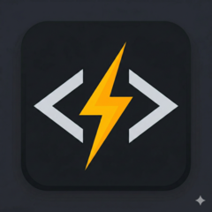

	
	<h1>QuickSnippets</h1>
	
<strong>A portable Windows launcher for your text snippets — always one keystroke away.</strong>

	

		
		
	

---

## What is QuickSnippets?

QuickSnippets is a small, portable desktop application that lets you keep a personal library of text snippets and paste any of them into any application within seconds.

Press **Ctrl+Alt+Space** from anywhere on your desktop. The window appears, you type a few letters to find the snippet you need, press **Enter**, and it's in your clipboard. No cloud, no telemetry, no installation required.

Sensitive snippets can be encrypted locally with AES-256-GCM so that only you — with the right password — can access them.

---

## Features

- **Instant access** — global hotkey shows the window from any application
- **Fast search** — fuzzy search filters your snippets as you type
- **Encrypted snippets** — protect sensitive content with a password (AES-256-GCM encryption, keys never leave your device)
- **Fully keyboard-driven** — every action has a shortcut; mouse is optional
- **Screen reader support** — built for NVDA, JAWS, and Windows Narrator from day one
- **Portable** — no installer, no registry, no `AppData`; the whole app lives in one folder
- **System tray** — stays out of your way when not in use; right-click the tray icon for quick actions
- **Light and dark themes** — switch with a single shortcut or from Settings
- **Two languages** — English and Ukrainian; language auto-detected from your system
- **Single-instance** — launching the app again simply brings the existing window to focus
- **Auto-hide on blur** — the window disappears when you switch away, just like a launcher

---

## Accessibility

QuickSnippets is built accessibility-first. Every feature is designed to work without a mouse and to be announced correctly by assistive technologies.

- All interactive elements carry descriptive ARIA labels and roles
- The snippet list is a proper `listbox` with `aria-activedescendant`; screen readers announce the selected snippet and its position (e.g. "Greeting, 1 of 12")
- Focus is trapped inside modal dialogs and returned to the originating element on close
- Live regions announce copy confirmations and error messages without moving focus
- The WebView2 accessibility tree is force-initialized at startup, so screen readers work correctly even when the app starts minimized to the tray
- `Ctrl+Shift+Space` reads the currently selected snippet aloud via a polite live region
- High contrast and system theme changes are respected
- Form inputs disable browser autocomplete to prevent assistive-technology confusion

---

## Security

- **Local-only encryption.** Encrypted snippets are stored as AES-256-GCM ciphertext in a local SQLite database. The decrypted content is never sent to the frontend process.
- **Strong key derivation.** Encryption keys are derived from your password using PBKDF2-HMAC-SHA256 with 100,000 iterations, a unique random salt, and a unique random nonce per encryption.
- **Clipboard operations in Rust.** When you activate an encrypted snippet, the Rust backend decrypts it and writes directly to the clipboard. The plaintext never crosses the IPC boundary.
- **No network access.** The application makes no outbound connections.

---

## Installation

QuickSnippets is a portable application — no installer needed.

1. Go to the [Releases page](https://github.com/ruslan-rv-ua/quick-snippets/releases).
2. Download the latest `quick-snippets-windows-x64-vX.Y.Z.zip`.
3. Extract the ZIP to any folder (e.g. `C:\Tools\QuickSnippets\`).
4. Run `quick-snippets.exe`.

Your snippets database (`snippets.db`) and settings (`settings.json`) are saved in the same folder as the executable. To move or back up the app, copy the entire folder.

> **SHA-256 checksum** — a `.sha256` file is attached to every release for verification.

---

## Getting Started

### First launch

On first launch the snippet list is empty. Press **Ctrl+N** (or **Insert**) to create your first snippet.

Give it a short, memorable title — that's what you search by. Paste or type the content. Optionally check the **Encrypted** box to protect it with a password. Press **Ctrl+Enter** or click **Save**.

### Finding and copying a snippet

1. Press **Ctrl+Alt+Space** from any application.
2. Start typing the snippet title. The list filters in real time.
3. Use **Arrow Up / Down** to move through results.
4. Press **Enter** to copy the selected snippet to the clipboard.
5. Switch to your target application and paste (**Ctrl+V**).

The QuickSnippets window hides automatically when you switch away.

### System tray

The application icon lives in the system tray. Right-click it for quick access to **Show**, **New Snippet**, **Settings**, and **Quit**.

---

## Keyboard Shortcuts

### Global (works from any application)

| Shortcut | Action |
|---|---|
| Ctrl+Alt+Space | Show / hide the QuickSnippets window |

### In the main window

> All letter shortcuts (Ctrl+N, Ctrl+E, Ctrl+D, Ctrl+F, etc.) use the physical key
> position, so they work regardless of the active OS keyboard layout (e.g. Ukrainian).

| Shortcut | Action |
|---|---|
| Arrow Up / Down | Move selection in the snippet list |
| Home / End | Jump to first / last snippet |
| Enter | Copy selected snippet to clipboard |
| Ctrl+N or Insert | Create new snippet |
| Ctrl+E | Edit selected snippet |
| Delete or Ctrl+D | Delete selected snippet |
| Ctrl+F or / | Focus the search box |
| Ctrl+, | Open Settings |
| Ctrl+Shift+T | Toggle light / dark theme |
| Ctrl+Shift+Space | Announce selected snippet (screen reader) |
| Escape | Close modal / clear search |

### In forms and modals

| Shortcut | Action |
|---|---|
| Ctrl+Enter | Confirm / save (works in all dialogs including exit and delete confirmation) |
| Escape | Cancel and close the modal |

---

## Settings

Open Settings with **Ctrl+,** or via the tray menu.

| Setting | Description |
|---|---|
| Theme | Light or dark interface |
| Language | English, Ukrainian, or auto-detect from system |
| Start in tray | Hide the window on launch; only the tray icon is visible |
| Launch on startup | Start QuickSnippets automatically when Windows starts |
| Confirm on close | Show a confirmation dialog before quitting |

---

## For Developers

See [DEVELOPMENT.md](DEVELOPMENT.md) for the full developer guide: prerequisites, build commands, testing, the release process, and troubleshooting.

The project uses **Tauri v2** (Rust backend) + **React 19 / TypeScript / Vite** (frontend) and follows a TDD approach.

---

## License

[MIT](LICENSE) — Copyright (c) 2026 Ruslan Iskov
