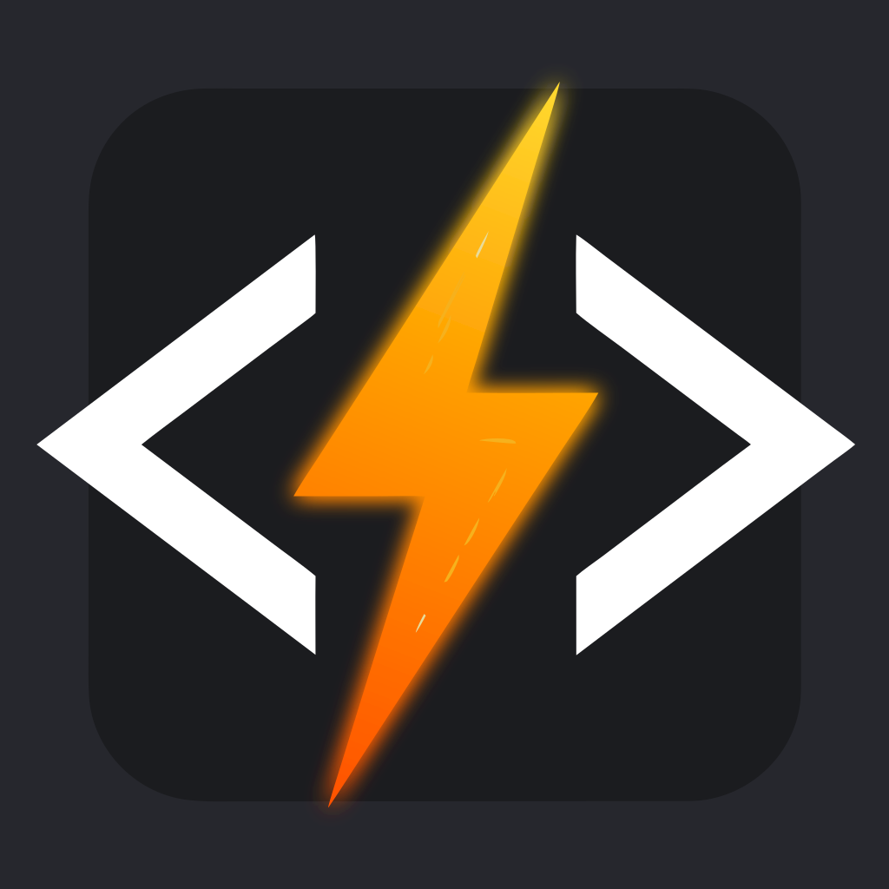

<div align="center">
	
	<h1>QuickSnippets</h1>
	<p><strong>A portable Windows launcher for your text snippets — always one keystroke away.</strong></p>
	<p>
		<a href="LICENSE"></a>
		<a href="https://github.com/ruslan-rv-ua/quick-snippets/releases"></a>
	</p>
	<p>
		🌐 <strong>Read this document in:</strong>
		<a href="README.md">English</a> ·
		<a href="README_UK.md">Українська</a> ·
		<a href="README_DE.md">Deutsch</a>
	</p>
</div>

---

## What is QuickSnippets?

QuickSnippets is a small, portable desktop application that lets you keep a personal library of text snippets and paste any of them into any application within seconds.

Press **Ctrl+Alt+Space** from anywhere on your desktop. The window appears, you type a few letters to find the snippet you need, press **Enter**, and it's in your clipboard. No cloud, no telemetry, no installation required.

Sensitive snippets can be encrypted locally with AES-256-GCM so that only you — with the right password — can access them.

---

## Features

- **Instant access** — global hotkey shows the window from any application
- **Fast search** — fuzzy search filters your snippets as you type
- **Encrypted snippets** — protect sensitive content with a password (AES-256-GCM encryption, keys never leave your device)
- **Fully keyboard-driven** — every action has a shortcut; mouse is optional
- **Screen reader support** — built for NVDA, JAWS, and Windows Narrator from day one
- **Portable** — no installer, no registry, no `AppData`; the whole app lives in one folder
- **System tray** — stays out of your way when not in use; right-click the tray icon for quick actions
- **Light and dark themes** — switch with a single shortcut or from Settings
- **Three languages** — English, Ukrainian, and German; language auto-detected from your system
- **Single-instance** — launching the app again simply brings the existing window to focus
- **Auto-hide on blur** — the window disappears when you switch away, just like a launcher
- **Auto-type** — press `Shift+Enter` to type a snippet directly into the active window; no clipboard required

---

## Installation

QuickSnippets is a portable application — no installer needed.

1. Go to the [Releases page](https://github.com/ruslan-rv-ua/quick-snippets/releases).
2. Download the latest `quick-snippets-windows-x64-vX.Y.Z.zip`.
3. Extract the ZIP to any folder (e.g. `C:\Tools\QuickSnippets\`).
4. Run `quick-snippets.exe`.

### Installing via Scoop

If you use [Scoop](https://scoop.sh/), you can install QuickSnippets from the official bucket:

```powershell
scoop bucket add ruslan-rv-ua https://github.com/ruslan-rv-ua/scoop-bucket
scoop install quick-snippets
```

Your snippets database (`snippets.db`) and settings (`settings.json`) are saved in the same folder as the executable. To move or back up the app, copy the entire folder.

> **SHA-256 checksum** — a `.sha256` file is attached to every release for verification.

---

## Getting Started

### First launch

On first launch the snippet list is empty. Press **Ctrl+N** (or **Insert**) to create your first snippet.

Give it a short, memorable title — that's what you search by. Paste or type the content. Optionally protect it with a password. Press **Ctrl+Enter** or click **Save**.

### Finding and copying a snippet

1. Press **Ctrl+Alt+Space** from any application.
2. Start typing the snippet title. The list filters in real time.
3. Use **Arrow Up / Down** to move through results.
4. Press **Enter** to copy the selected snippet to the clipboard.
5. Switch to your target application and paste (**Ctrl+V**).

Alternatively, press **Shift+Enter** (instead of **Enter**) to auto-type the snippet directly into the previously active window — without using the clipboard. The window hides, focus returns to the target app, and the text is typed character by character.

The QuickSnippets window hides automatically when you switch away.

### System tray

The application icon lives in the system tray. Right-click it for quick access to **Show**, **New Snippet**, **Settings**, and **Quit**.

---

## Security Model

Your privacy is paramount. QuickSnippets is designed to keep your snippets on your device, encrypted if you choose.

### How Your Data Is Protected

- **AES-256-GCM encryption** — sensitive snippets can be password-protected with military-grade encryption
- **PBKDF2 key derivation** — passwords are stretched with 100,000 iterations to resist brute-force attacks
- **Unique salt and nonce** — every encryption uses random values, so the same snippet encrypted twice produces different ciphertexts
- **Local storage only** — your database (`snippets.db`) and settings (`settings.json`) live in the application folder; no cloud, no telemetry, no sync
- **No registry** — QuickSnippets does not touch Windows registry or AppData directories
- **Portable** — copy your entire QuickSnippets folder to back up or migrate everything

### What Is Encrypted

- **Snippet content** — if you choose to protect a snippet with a password, its content is encrypted

### What Is NOT Encrypted

- **Snippet title** — used for searching; stored as plaintext so you can find your snippets
- **Metadata** — creation and modification timestamps are not encrypted
- **Settings** — window geometry, theme preference, language are stored in plaintext

### Memory Safety

- Session keys are held in memory only during decryption
- Plaintext is immediately cleared (zeroized) after use
- No unencrypted data is written to disk

### Important Limitations

- **Timing attacks**: Password verification is not constant-time; use strong passwords
- **Brute-force at UI**: There is no rate limiting on password attempts; only physical security protects against local attacks
- **Device security**: If someone gains access to your device while QuickSnippets is running, they can potentially decrypt snippets by watching memory or clipboard

For complete details on the security model, threat assessment, and responsible disclosure process, see [SECURITY.md](SECURITY.md).

---

## Keyboard Shortcuts

### Global (works from any application)

| Shortcut | Action |
|---|---|
| Ctrl+Alt+Space | Show / hide the QuickSnippets window |

### In the main window

> All letter shortcuts (Ctrl+N, Ctrl+E, Ctrl+D, Ctrl+F, etc.) use the physical key
> position, so they work regardless of the active OS keyboard layout (e.g. Ukrainian).

| Shortcut | Action |
|---|---|
| Arrow Up / Down | Move selection in the snippet list |
| Home / End | Jump to first / last snippet |
| Enter | Copy selected snippet to clipboard |
| Shift+Enter | Auto-type selected snippet into the active application |
| Ctrl+N or Insert | Create new snippet |
| Ctrl+E | Edit selected snippet |
| Delete or Ctrl+D | Delete selected snippet |
| Ctrl+F or / | Focus the search box |
| Ctrl+, | Open Settings |
| Ctrl+Shift+T | Toggle light / dark theme |
| Ctrl+Shift+Space | Announce selected snippet (screen reader) |
| Escape | Close modal / clear search |
| Alt+F4 | Quit the application |

### In forms and modals

| Shortcut | Action |
|---|---|
| Ctrl+Enter | Confirm / save (works in all dialogs including exit and delete confirmation) |
| Escape | Cancel and close the modal |

---

## Settings

Open Settings with **Ctrl+,** or via the tray menu.

| Setting | Description |
|---|---|
| Theme | Light or dark interface |
| Language | English, Ukrainian, German, or auto-detect from system |
| Start in tray | Hide the window on launch; only the tray icon is visible |
| Launch on startup | Start QuickSnippets automatically when Windows starts |
| Confirm on close | Show a confirmation dialog before quitting |
| Autotype delay (ms) | Inter-character delay for auto-type (default: 1 ms). Set to `0` for maximum speed. Increase to 10–50 ms if characters are dropped or appear out of order in the target app. **Note:** Auto-type does not work into applications running with elevated privileges (Run as administrator). |

---

## License

[MIT](LICENSE) — Copyright (c) 2026 Ruslan Iskov
